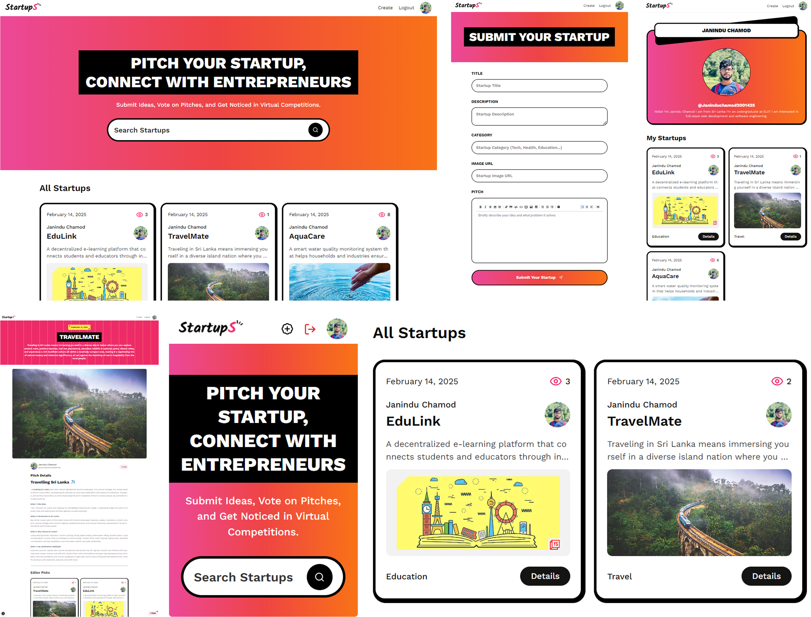

# StartupS




 <div>
    
    
    
    

  </div>

A dynamic space for startups and hiring.

#### Create next App

```bash
npx create-next-app@latest
```

#### Install Next Auth

```bash
npm install next-auth
```

#### Get the Auth Secret

```bash
npx auth secret
```

#### shadcn components

```bash
npx shadcn@latest add input textarea toast     
```
